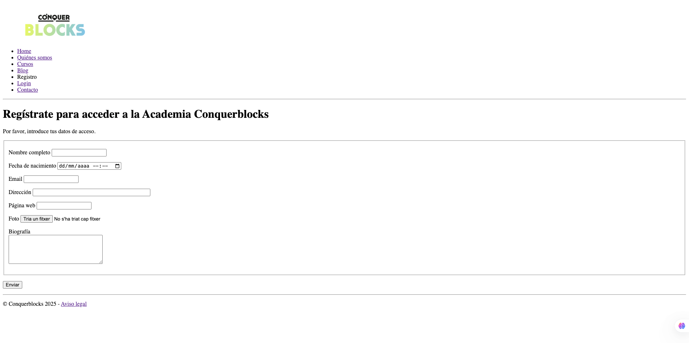

# Final HTML Project

This is my **final HTML project** for the Full-Stack Development Master's program.  
The goal was to create a **complete website** entirely with HTML, applying best practices, semantic elements, and including links to other pages, images, videos, and forms.

## Project structure
- `index.html` → Main page with links to all subpages.
- `quienes-somos.html` → Information about the teaching staff.
- `cursos.html` → List of available courses and trainings.
- `blog.html` → Relevant news and updates from the tech world.
- `registro.html` → Page to register for the academy.
- `login.html` → Login page to access your account.
- `contacto.html` → Contact form to send inquiries or messages.

## Screenshots
### Main page
**Code:**  
  
**Preview:**  

### Blog Detail Page
**Code:**  
  
**Preview:**  

### Register page
**Code:**  
  
**Preview:**  

## Technologies used
- HTML5  
- Visual Studio Code  
- Live Server

## Notes
- Semantic elements have been used to improve accessibility.  
- The project is fully structured and easy to maintain.

